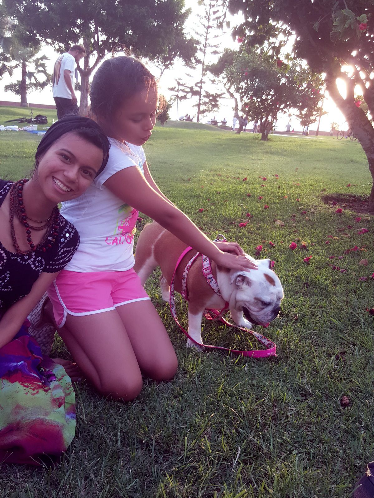
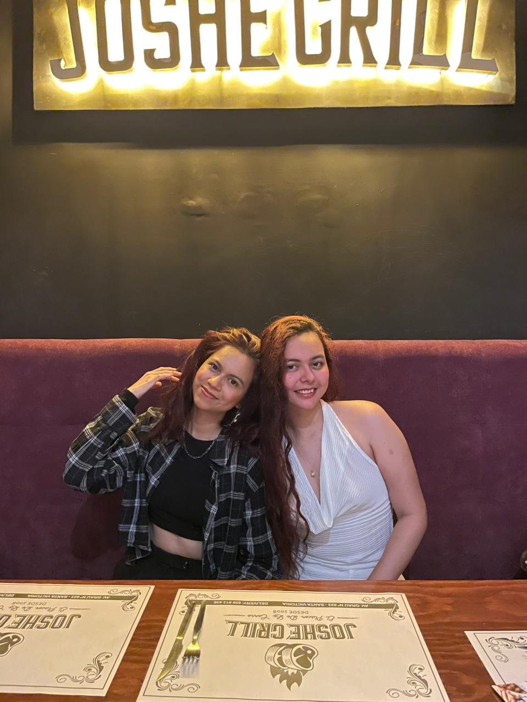
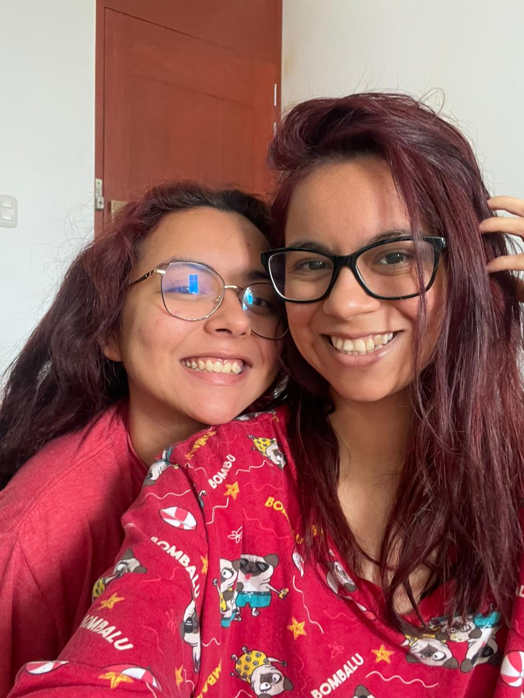

<!DOCTYPE html>
<html lang="es">
<head>
  <meta charset="UTF-8">
  <title>Feliz Cumple</title>

  
</head>

<body>

<!-- 🎵 Música -->
<audio id="musica" loop>
  <source src="20.mp3" type="audio/mpeg">
</audio>

<!-- 💗 PRIMERA PANTALLA -->

  

    

      Feliz cumple, te amo cada dia ♥
    

    
    
    
    
    
  

<!-- 🎬 SEGUNDA PANTALLA -->

  <video id="video" src="1.mp4" controls></video>

</body>
</html>
